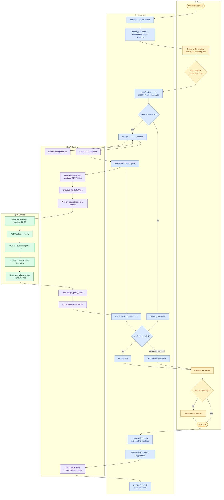

## Swimlanes

Four lanes, one journey. Everything below the "photo prepared" line can fail
without the patient losing the ability to record a measurement — that is the
property the whole flow is arranged around.

## Reading the lanes

- **Only lane 1 is allowed to feel synchronous.** Everything the patient does —
  framing, capturing, correcting, saving — completes against local state.
  Lanes 3 and 4 are explicitly allowed to take seconds.
- **The fork at "network available?" is not a fallback, it is a peer.** Both
  branches produce the same `ReadOutcome` and meet again at the same form.
- **The save crosses to lane 3 twice, and neither crossing blocks the user.**
  Once for the image (before the reading exists) and once for the reading
  itself, through the outbox drain rather than directly.
- **Nothing in lane 4 can reach the patient's data.** ai-service holds no S3
  credentials and no database connection; it is handed a presigned URL and
  answers with numbers.
