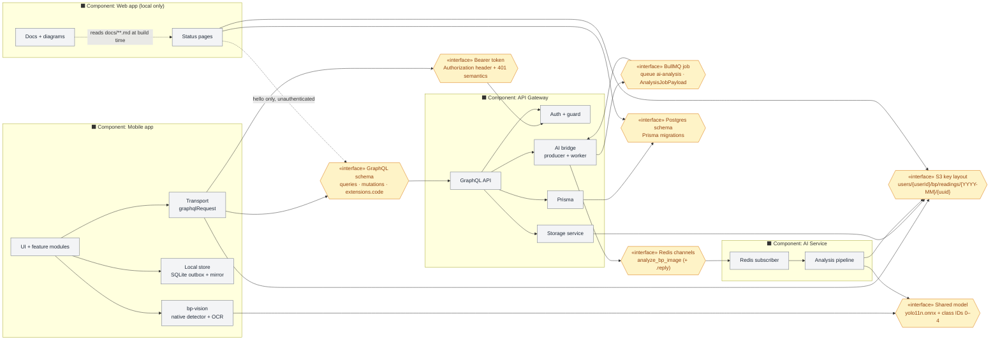

## Components and their contracts

Read an edge as "requires". A component can be replaced freely as long as the
interfaces on its boundary keep their shape — and every one of those shapes is
duck-typed, so "keeps its shape" is a review responsibility, not a compiler's.

## The interfaces, and what a change to each costs

| Interface | Owned by | Break it and… |
| --- | --- | --- |
| GraphQL schema | `api-gateway/src/**/*.gql` → `schema.gql` | the mobile app fails at runtime; there is no build-time link between them |
| `extensions.code` | `app.module.ts` error formatter | global logout, throttle countdowns, and inline messages all key on these strings |
| Bearer token + 401 | `auth.guard.ts` + client transports | a revoked session stops propagating, or every user is logged out at once |
| S3 key layout | `storage/types/storage.types.ts` | ownership checks (`isFinalKeyOwnedBy`) reject valid keys, or accept invalid ones |
| BullMQ job payload | `ai/types/ai.types.ts` | jobs fail on parse; the client polls a job that never completes |
| `analyze_bp_image` channels | `ai.process.ts` ↔ `handlers.py` | **silent failure** — the gateway waits for a reply that never matches, and times out at 55 s |
| Shared ONNX model + class IDs | `detection.ts` ↔ `yolo.py` | the phone approves framing the server cannot read |
| Postgres schema | Prisma migrations | the gateway and `web/`'s direct reads break independently |

## Rules that fall out of this picture

- **Two of these interfaces have no runtime error to catch.** A renamed field
  on the Redis payload and a drifted class ID both fail as *wrong behaviour*,
  not as an exception. They are the reason rule 5 in the root `AGENTS.md`
  exists.
- **`web/` requires two interfaces nobody thinks of it as consuming** — the
  Postgres schema and the S3 key layout. A migration that renames a column can
  break the dashboard without touching a single gateway file.
- **The mobile app requires the S3 layout directly**, because it PUTs to the
  presigned URL itself. The gateway builds the key, but the client is the one
  holding the bytes when it is used.
