## Full schema

Source of truth: `server/app/api-gateway/prisma/schema.prisma` — 13 models and
8 enums. Four of the models (`User`, `Account`, `UserSession`, `Verification`)
are Better Auth's, extended with this project's own columns rather than
duplicated alongside them; `Passkey` is the passkey plugin's. Everything else
is domain data.

```mermaid
erDiagram
    %% ── Identity (Better Auth owns these four) ──
    User ||--o{ Account : "credential + OAuth"
    User ||--o{ UserSession : "owns"
    User ||--o{ Passkey : "registers"
    User ||--o{ PushToken : "notified_on"

    %% ── Care relationships and audit ──
    User ||--o{ CaregiverPatient : "caregiver_of"
    User ||--o{ CaregiverPatient : "patient_of"
    User ||--o{ ProfileChangeLog : "subject_of"
    User ||--o{ ProfileChangeLog : "actor_of"

    %% ── Clinical data ──
    User ||--o{ BloodPressureReading : "records"
    User ||--o{ BloodPressureReading : "recorded_on_behalf"
    User ||--o{ Image : "uploads"
    User ||--o{ Alert : "receives"
    BloodPressureReading ||--o| Image : "captured_by"
    BloodPressureReading ||--o{ Alert : "triggers"

    %% ── Community ──
    User ||--o{ Post : "writes"
    User ||--o{ PostComment : "comments"
    User ||--o{ PostLike : "likes_post"
    User ||--o{ PostCommentLike : "likes_comment"
    Post ||--o{ PostComment : "has"
    Post ||--o{ PostLike : "has"
    PostComment ||--o{ PostCommentLike : "has"
    PostComment ||--o{ PostComment : "replies_to"

    User {
        uuid id PK
        string email UK "required — the proof account linking depends on"
        bool email_verified
        string name "Better Auth display name, 201 chars"
        string firstname
        string lastname
        string phone UK "NOT NULL — caregivers find patients by phone"
        bool phone_number_verified
        string password_hash "legacy bcrypt; Better Auth writes accounts.password"
        enum role "caregiver | developer | patient"
        timestamp role_selected_at "null = onboarding role step still due"
        string last_login_method "email | phone-number | google | passkey"
        bool banned
        string ban_reason
        timestamp ban_expires
        date dob
        enum gender "male | female | other"
        float weight
        float height
        string congenital_disease
        string avatar "mapped to Better Auth image"
        timestamp created_at
        timestamp updated_at
    }

    Account {
        uuid id PK
        string account_id "provider's own id"
        string provider_id "credential | google"
        uuid user_id FK
        string password "bcrypt hash when provider_id = credential"
        string access_token
        string refresh_token
        string id_token
        timestamp access_token_expires_at
        timestamp refresh_token_expires_at
        string scope
        timestamp created_at
        timestamp updated_at
    }

    UserSession {
        uuid id PK
        uuid user_id FK
        string token UK
        timestamp expires_at
        string ip_address
        string user_agent
        uuid impersonated_by "admin plugin"
        string device_label
        bool is_active "logout flips this; the guard's kill switch"
        timestamp revoked_at
        timestamp last_active_at
        timestamp created_at
        timestamp updated_at
    }

    Passkey {
        uuid id PK
        uuid user_id FK
        string credential_id UK
        string public_key
        int counter
        string device_type
        bool backed_up
        string transports
        string aaguid
        string name
        timestamp created_at
    }

    Verification {
        uuid id PK
        string identifier "email or phone the code was issued to"
        string value "OTP or token"
        timestamp expires_at
        timestamp created_at
        timestamp updated_at
    }

    PushToken {
        uuid id PK
        string token UK "ExponentPushToken[…] — unique across ALL users"
        uuid user_id FK
        string device_label
        string platform "ios | android"
        timestamp last_registered_at
        string pending_receipt_id "unresolved Expo delivery receipt"
        timestamp pending_receipt_at
        timestamp created_at
        timestamp updated_at
    }

    CaregiverPatient {
        uuid caregiver_id PK,FK
        uuid patient_id PK,FK
        enum relationship "parent | patient | caregiver | child | spouse"
        enum status "pending | accepted | rejected"
        enum permission "view | full — default full, revocable any time"
        timestamp created_at
        timestamp responded_at
    }

    ProfileChangeLog {
        uuid id PK
        uuid patient_id FK "cascade — the trail belongs to the record"
        uuid actor_id FK "SetNull — erasure must not erase the patient's trail"
        string actor_name "denormalised, survives actor deletion"
        string field "one row per field, not per request"
        string old_value "rendered text; null = genuinely unset"
        string new_value
        timestamp changed_at
    }

    BloodPressureReading {
        int id PK
        uuid user_id FK "whose reading it is"
        string client_id UK "offline dedupe seam, minted on device"
        uuid recorded_by_id FK "set only when someone else logged it"
        int systolic
        int diastolic
        int pulse
        enum status "low | normal | elevated | high | critical"
        timestamp measured_at "device clock, uncorrected"
        string notes
        timestamp created_at
        timestamp updated_at
    }

    Image {
        int id PK
        uuid user_id FK
        string s3_key UK "the analysis reply is keyed on this"
        int reading_id FK,UK "nullable + unique — at most one image per reading"
        string device_name
        float image_quality_score "written back by AiProcessor, provisional"
        timestamp uploaded_at
        timestamp updated_at
    }

    Alert {
        int id PK
        uuid user_id FK
        int bp_reading_id FK
        string alert_message
        enum alert_level "warning | critical"
        timestamp read_at
        timestamp created_at
        timestamp updated_at
    }

    Post {
        int id PK
        uuid user_id FK
        string client_id UK
        text content
        enum category "general | experience | qa"
        timestamp created_at
        timestamp updated_at
    }

    PostComment {
        int id PK
        int post_id FK
        uuid user_id FK
        int parent_id FK "null = top-level"
        text content
        timestamp created_at
        timestamp updated_at
    }

    PostLike {
        uuid user_id PK,FK
        int post_id PK,FK
        timestamp created_at
    }

    PostCommentLike {
        uuid user_id PK,FK
        int comment_id PK,FK
        timestamp created_at
    }
```

## Things worth a second look

- **Credentials live on `accounts`, not on `users`** — Better Auth writes the
  password hash to `accounts.password` for `provider_id = 'credential'`.
  `users.password_hash` is the legacy bcrypt column, kept only until the
  backfill is verified against real sign-ins. Two places that look like they
  hold the same secret; only one of them is written to now.
- **`email` and `phone` are both `@unique` and both sign-in identifiers** —
  which is why the caregiver edit path cannot touch either. A caregiver who
  could change one could request a password reset and take the account.
- **`verifications` has no foreign key on purpose** — it is keyed by
  `identifier` (the email or phone the code was sent to), so a code can be
  issued before an account exists.
- **client_id on readings and posts** — Unique nullable string from the mobile
  client (`createClientId`). The dedupe seam between offline create and server
  insert — re-syncing the same local row never creates a duplicate.
- **Image.reading_id is nullable + unique** — An image can exist before its
  reading row (uploaded during capture, attached on confirm) but at most one
  reading per image. SetNull on delete keeps history rather than cascading.
- **CaregiverPatient is self-relation on User** — Composite PK (caregiver_id,
  patient_id). The same row pairs a caregiver and a patient with a typed
  relationship. Cascades on either side delete the link, not the people.
  `permission` (`view` | `full`, default `full`) is what an *accepted* link
  grants: `full` covers recording readings on the patient's behalf and
  editing their health information, and the patient can move it either way at
  any time via `updateCaregiverPermission`.
- **ProfileChangeLog is the audit for that second power** — One row per field
  changed, not per request, so "weight 60 → 80, by whom, when" is a row rather
  than a diff someone has to reconstruct. Values are stored as rendered text
  because the five editable fields span four types and the consumer is a human
  reading a list; `null` on either side distinguishes unset from cleared.
  `patient_id` cascades — the trail belongs to the record it describes — but
  `actor_id` is `SetNull` with a denormalised `actor_name` beside it, so
  deleting a caregiver's account cannot erase the patient's record of what
  that caregiver did. `Restrict` was the alternative and is worse: it would
  make an audit row a permanent block on the actor's right to erasure. Only
  the patient can read their own trail; there is deliberately no
  caregiver-facing query, because every row carries the patient's health
  values and revocation has to be complete.
- **push_tokens is keyed on the token, not on the user** — An Expo push token
  belongs to an app *installation*, so `token` is globally `@unique` rather
  than unique per user. That is what makes a shared handset correct:
  registering as a second account reassigns the row instead of adding one, so
  a patient's critical reading cannot reach whoever used the phone last. The
  price of not hanging it off `user_sessions` is that logout has to delete it
  explicitly (`AuthService.logout` does) — a token must survive session
  rotation, or a caregiver silently stops receiving alerts the moment their
  session refreshes. `pending_receipt_id` parks Expo's delivery receipt so the
  30-minute sweep can drop tokens reported `DeviceNotRegistered`; one row per
  token is enough, because a newer receipt supersedes an older one.
- **user_sessions, not session cookies** — Every authenticated request
  validates the session row exists with is_active=true. Logout flips the flag;
  sessions table is also the data behind the device-history screen.
- **PostComment.parent_id self-relation** — Threaded replies one level deep are
  modelled with parent_id pointing back to PostComment. parent_id IS NULL means
  top-level.
