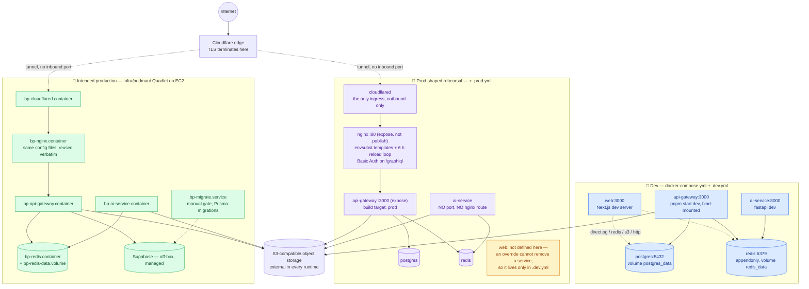

## The three runtimes

Same images, three supervisors, and a deliberately shrinking surface as you
move right. The only ingress in the two right-hand columns is a Cloudflare
Tunnel connector, so **no host port is published to the internet at all**.

## What the topology is defending against

- **No published port in the prod-shaped stack** — `api-gateway` uses `expose`,
  not `ports`. nginx is reachable only from `cloudflared` over `bp-net`, and
  `cloudflared` makes an outbound connection to Cloudflare. There is nothing to
  port-scan.
- **Point the tunnel at nginx, never at the gateway** — nginx owns the
  `/graphiql` Basic Auth gate and the per-IP flood guard on `/graphql`.
  Bypassing it removes both silently.
- **ai-service is unreachable from outside the network** — no published port,
  no nginx route. It used to publish `8000:8000`, which was a real
  internet-facing exposure of an internal service with no auth in front of it.
  Its only caller is api-gateway over Redis.
- **`web/` is not in any deployed stack** — it is defined in
  `docker-compose.dev.yml` only, because an override file can change a service
  but cannot remove one. It has no authentication of its own and its `/admin`
  pages read Postgres, Redis, and S3 directly; removing it from the deploy is
  the version of that decision that cannot regress when someone edits an nginx
  config.
- **The web build context is the repo root** — the docs site prerenders
  `docs/**/*.md` at build time, and a context rooted at `web/` cannot reach a
  sibling directory.
- **Migrations are a manual gate** — `bp-migrate.service` is a separate,
  operator-triggered unit. Nothing in the deploy path runs a migration for you.

## Where the documents disagree

Two statements in this repo cannot both be current:

- `infra/README.md` and `infra/podman/README.md` describe **Podman Quadlet on
  EC2 with Supabase** as production, and the Compose stacks as development and
  prod-parity staging.
- `infra/podman/README.md` also states plainly that **nothing in that directory
  has ever been executed** — no unit loaded, no image built, no EC2 host
  involved.

So the Quadlet column above is a reviewed design, not an observed runtime, and
whichever stack the live host is running today, the operational history sits
with the Compose files. Treat "production" in the podman docs as intent until
someone records a first successful run; if you are looking for what a running
box actually does, read the Compose prod overlay and
[docs/guides/deploy.md](../guides/deploy.md), and reconcile the two before
relying on either.
