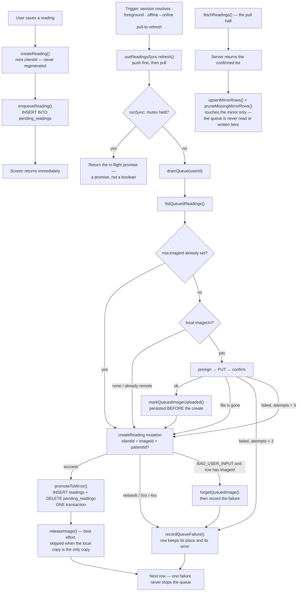

## Save → drain → reconcile

Three separate concerns, and only the middle one is allowed to be slow: the
save writes locally and returns, `drainQueue` pushes rows one at a time and
records failures on the row, and the pull reconciles the mirror. `useReadingsSync`
is the only thing that triggers the second and third automatically.

## Invariants

- **One module-level mutex, and it hands out the in-flight promise.** `runSync`
  is triggered from at least three places; a per-hook guard would let each start
  its own pass over the same rows, and a boolean would let the second caller
  report success for work that had not happened yet.
- **`clientId` is minted once and never regenerated.** It is the queue's key on
  device and carries a unique constraint on the server — the only thing standing
  between an interrupted sync and two identical readings in someone's history.
- **The save never blocks on the network.** `createReading` writes to
  `pending_readings` and returns; the screen renders from SQLite.
- **An upload is recorded before the create runs.** If the create then fails,
  the next pass sees `imageId` and skips the upload instead of minting a second
  `Image` row and orphaning the first object.
- **A photo never holds the numbers hostage.** A missing local file is not a
  failure at all, and a failing upload is retried at most `IMAGE_ATTEMPT_LIMIT`
  (3) times before the reading goes up without it.
- **Two tables, and the promotion is transactional.** `pending_readings` is the
  outbox; `readings` is the mirror of what the server confirmed.
  `promoteToMirror` inserts into one and deletes from the other in a single
  transaction. Split it and you get either a duplicated reading or a vanished
  one — see [Reading Lifecycle](./state-reading-lifecycle.md) for why the old
  single-table-plus-`syncStatus` design was abandoned.
- **Reconciliation cannot eat queued rows.** `fetchReadings` writes to the
  mirror only. Because the queue is a different table rather than a filtered
  subset of the same one, a reconciliation pass running while a sync is in
  flight is structurally unable to touch pending work — it is not relying on
  anyone remembering a `WHERE` clause.

## What can still go wrong

- **App killed mid-sync.** The mutex is not durable, so a reading that was
  being sent comes back queued on next launch — correct, because promotion is
  the only thing that removes it, and that is transactional. The retry is
  absorbed by `clientId`: it is the queue's primary key on device and carries a
  unique constraint on the server, so a duplicate submit lands once.
- **Clock skew on `measuredAt`.** It comes from the device and is not
  corrected. A patient whose phone clock is wrong gets history that disagrees
  with what their caregiver sees.
- **A poison row keeps failing quietly.** Rule 5 records the failure and moves
  on, which is right for the queue as a whole, but nothing escalates a row that
  has failed many times — the user sees "รอซิงค์" and no explanation.
- **An `imageId` minted under another account is dropped, not retried.** A
  `BAD_USER_INPUT` on a row that carries one clears the id so the next pass
  re-uploads under the current account; the alternative is a reading rejected
  identically forever.
