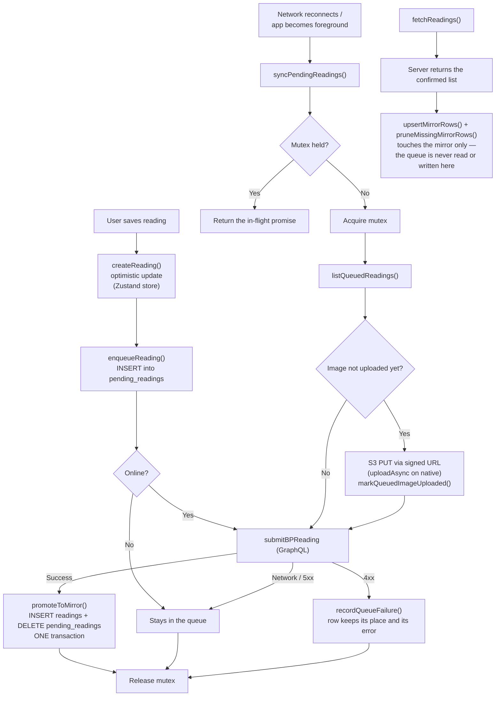

## Save → sync → reconcile

Branches show the path under network loss; the happy path is the leftmost
spine.

## Invariants

- **One mutex per sync function.** `syncPendingReadings` and
  `syncPendingPosts` each hold a promise-based mutex; concurrent callers get
  the in-flight promise. Never a boolean flag.
- **The optimistic update never blocks the UI.** `createReading` writes to the
  store before any network call, so the reading appears immediately on a flaky
  link.
- **Two tables, and the promotion is transactional.** `pending_readings` is the
  outbox; `readings` is the mirror of what the server confirmed.
  `promoteToMirror` inserts into one and deletes from the other in a single
  transaction. Split it and you get either a duplicated reading or a vanished
  one — see [Reading Lifecycle](./state-reading-lifecycle.md) for why the old
  single-table-plus-`syncStatus` design was abandoned.
- **Reconciliation cannot eat queued rows.** `fetchReadings` writes to the
  mirror only. Because the queue is a different table rather than a filtered
  subset of the same one, a reconciliation pass running while a sync is in
  flight is structurally unable to touch pending work — it is not relying on
  anyone remembering a `WHERE` clause.

## What can still go wrong

- **App killed mid-sync.** The mutex is not durable, so a reading that was
  being sent comes back queued on next launch — correct, because promotion is
  the only thing that removes it, and that is transactional. The retry is
  absorbed by `clientId`: it is the queue's primary key on device and carries a
  unique constraint on the server, so a duplicate submit lands once.
- **Clock skew on `measuredAt`.** It comes from the device and is not
  corrected. A patient whose phone clock is wrong gets history that disagrees
  with what their caregiver sees.
