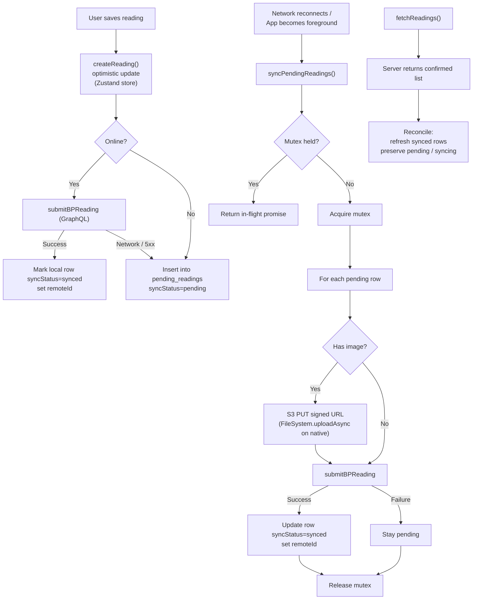

## Save → sync → reconcile

Branches show the path under network loss; the happy path is the leftmost
spine.

## Invariants

- **One mutex per sync function** — syncPendingReadings and syncPendingPosts
  each hold a promise-based mutex. Concurrent callers return the in-flight
  promise — never replaced with a boolean.
- **Optimistic update never blocks UI** — createReading writes to the store
  before any network call. The UI shows the new reading in <16ms even on a
  flaky link.
- **pending_readings is queue AND mirror** — syncStatus discriminates: pending
  (queued), pending-image (queued, image upload not done), synced
  (server-confirmed). Reinstall + offline launch still shows history because
  synced rows live in the same table.
- **Reconciliation refreshes, not replaces** — fetchReadings refreshes synced
  rows from the server but preserves pending / pending-image. A reconciliation
  pass while a sync is in flight cannot eat queued rows.

## What can still go wrong

- **App killed mid-sync** — Rows that were `syncing` on kill come back as
  `pending` next launch (mutex isn't durable). createClientId is the dedupe —
  server's @@unique on client_id absorbs the retry.
- **Clock skew on measuredAt** — measuredAt comes from the device; we don't
  correct it. A patient with the wrong phone clock will have history that
  disagrees with the caregiver's view.
