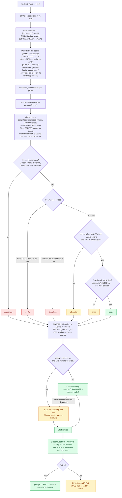

## Decision tree

Detection is native. `client/modules/bp-vision/` is a local Expo module in
Kotlin (Android only) wrapping ONNX Runtime; the JS side calls `detect()` per
analysis frame and `readBp()` for the full offline OCR pipeline. Both are
resolved with `requireOptionalNativeModule`, so on iOS, web, and Expo Go they
return "nothing found" and "unavailable" instead of throwing.

**Two detector export families decode, and the graph picks.** `yolo11n.onnx`
(and the rest of the anchors-family comparison set) emits raw `[1, 4+C, anchors]`
and owes per-class NMS to the decoder; `yolo26n-adamw-color.onnx` — the
shipped default on both the phone and ai-service — and the other `yolo26n-*`
exports emit `[1, 300, 6]` rows of `(x1, y1, x2, y2, conf, cls)` with the
suppression already done inside the graph, which makes the IoU threshold
inert for them. Kotlin's `YoloDetector.resolveOutputFormat` and ai-service's
`resolve_output_format` both read the format off the loaded graph's declared
output shape and both throw at load on anything else, because decoding one
family as the other does not fail — it returns confident, wrong boxes. **The
phone now loads `yolo26n-adamw-color.onnx`**, same as ai-service; the dual
decode remains so either side can still be pointed at a comparison-set model
(e.g. `yolo11n.onnx`) independently without the other's decoder breaking.

## Shared-model contract

- **Byte-identical model file** — `client/assets/models/yolo26n-adamw-color.onnx`
  and `server/app/ai-service/models/yolo26n-adamw-color.onnx` are the same
  bytes. `pnpm verify-models` on every `pnpm start` asserts SHA256 equality
  against `server/app/ai-service/models/EXPECTED_HASHES.json`.
- **Class IDs are a wire contract** — 0 `BP_Monitor` / 1 `BP_Screen_Monitor` /
  2 `dia` / 3 `pulse` / 4 `sys` — mirrored in
  `client/src/modules/capture/lib/detection.ts` and
  `server/app/ai-service/src/ai_service/analyzer/yolo.py::CLASS_NAMES`. Change
  one side, change the other.
- **Both monitor classes count** — keying "a monitor is in shot" on class 0
  alone reports nothing over a plainly readable display: measured on device, the
  outer box drops out first at harder framings while the screen and the digit
  fields are still found.
- **Thresholds in lock-step** — confidence 0.25, IoU 0.45, input edge 512 — the
  same on both sides. Tune the detector, tune both call sites, or the phone and
  the server disagree about what "detected" means.
- **Retraining process** — retrain in ai-service, regenerate
  `EXPECTED_HASHES.json` and upload the new bytes to R2, then `cd client &&
  pnpm sync-yolo-model`. Ship the manifest and the refreshed bundled copies in
  one PR or the verify hook fails.

## Why nudge, not gate

- **A false negative must never block a measurement** — glare, partial frames,
  and low light all produce them. The framing gate only drives auto-capture; the
  shutter is always live, and a captured photo always reaches either the server
  or the manual form.
- **`minFields` is 2, not 3, on purpose** — requiring all three digit groups
  makes "ready" hostage to whichever is hardest to detect. Capturing slightly
  early only costs the full-resolution pass a little more work; it re-reads the
  photo at full size regardless of what the live gate saw.
- **The thresholds are the tuning surface** — `DEFAULT_FRAMING_THRESHOLDS` and
  the two countdown constants are exported from the capture module precisely
  because they are expected to move once this meets real hardware and real
  users.
- **The a11y countdown is longer, not absent** — the ring is a purely visual
  cue, so a screen-reader user gets one spoken announcement and 2500 ms to act
  on it rather than having the feature withheld.
