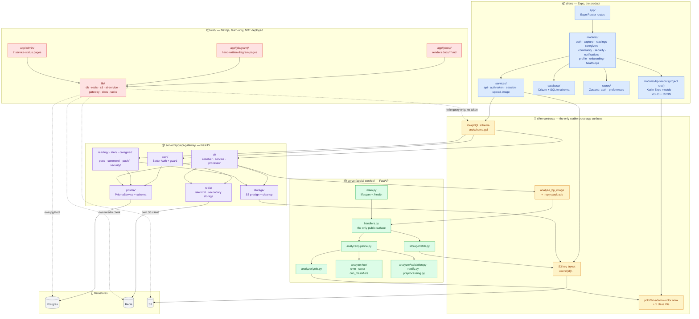

## Packages and dependencies

An arrow means "depends on at build or call time". Nothing crosses an app
boundary except through the three wire contracts at the bottom — the GraphQL
schema, the Redis payloads, and the S3 key layout. There is no shared types
package, by choice.

## What the arrows are actually claiming

- **`client/modules/bp-vision/` is not under `src/`** — Expo's autolinking
  scans `<project root>/modules` for local native modules, so the native
  package sits beside `src/`, sharing a name with the feature modules inside
  it. Moving it would mean carrying a non-default autolinking config that no
  Expo doc mentions.
- **`web/` is a fifth datastore consumer, not a gateway client** — its only
  gateway call is an unauthenticated `hello` liveness probe. A change to the
  shape of any datastore can break the dashboard without touching the gateway
  at all, and no type-checker anywhere will notice.
- **`ai-service` has exactly one public surface** — `handlers.py`. There is no
  HTTP API beyond `/health`; anything that wants analysis goes through the
  Redis channel pair.
- **The gateway is the only writer to Postgres** — `PrismaService` is a leaf in
  this graph on purpose. `web/` reads Postgres directly, but nothing outside
  the gateway writes it.
- **No shared types package** — the DTOs on both sides of the Redis channel are
  hand-mirrored. The cost is real (a rename silently breaks the flow); the
  benefit is that each app ships without a build-time coupling to the others.

## Dependency rules that hold today

| Rule | Enforced by |
| --- | --- |
| One PR touches one app | Review, not tooling |
| `client/` never imports gateway source | Separate `package.json`, no workspace |
| Node and Python deps never mix | Separate manifests (`pnpm` vs `uv`) |
| Every manifest entry is imported somewhere | Review — "no ghost packages" |
| Install via package-manager commands only | Lockfile diff in review |

Each app's own `AGENTS.md` owns the details; the root one owns the rules.
