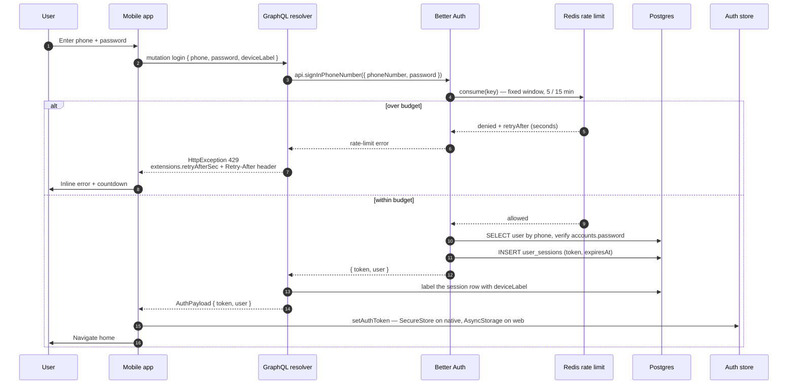
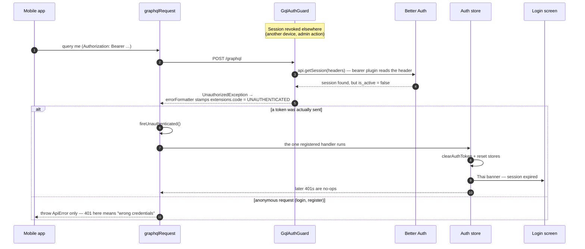

## Login + throttle

The mobile app never calls Better Auth's REST routes directly. It calls the
GraphQL `login` mutation, and `AuthService` calls `auth.api.signInPhoneNumber`
in-process. That keeps one transport on the client while the identity logic —
credential storage, account linking, rate limiting — stays inside Better Auth.

Throttling is Better Auth's, configured at 5 attempts per 15 minutes and backed
by Redis through a custom storage adapter (`RateLimitService.consume`, an
`INCR` + `PEXPIRE` in one Lua call). The old `login-throttle.guard.ts` is gone;
the replacement also covers the email route the guard never knew about.

Same shape, different door: `register`, `loginWithGoogleIdToken` (Credential
Manager hands the app a Google ID token, exchanged through `signInSocial`), and
passkey sign-in all end at the same "session row + bearer token" state. Only the
first two steps differ. The full identity model is in
[AUTH-better-auth-identity.md](./AUTH-better-auth-identity.md).

## 401 fan-out

One handler, every transport. A new transport that skips
`fireUnauthenticated()` means a session revoked from another device never
propagates — the user sits on a screen that silently fails every query.

## Why this shape

- **Token, not cookie** — the mobile client cannot carry cookies usefully, so
  the `bearer` plugin translates `Authorization: Bearer …` into the session
  cookie Better Auth expects. Everything downstream of the guard is ordinary
  Better Auth.
- **A revocable row behind the token** — sign-out flips `is_active` rather than
  deleting `user_sessions`, so the login-sessions screen can still show device
  history, and the guard has a kill switch Better Auth itself does not know
  about.
- **`extensions.code = 'UNAUTHENTICATED'` is a client-visible API** — the
  global logout keys on exactly that string. Renaming or widening it either
  logs everyone out or stops logging them out when it should.
- **The 401 fan-out is guarded by "was a token sent"** — logging out a user who
  is not logged in would race the login mutation's own error handling and
  produce a session-expired banner on a failed first login.
- **Retry-After is dual-channel** — the throttle answer travels both in
  `extensions.retryAfterSec` and as a real `Retry-After` header, so the mobile
  countdown and any proxy in the path both see it.
- **Token storage straddles platforms** — SecureStore on native, AsyncStorage
  on web. Always go through `setAuthToken` / `getAuthToken` / `clearAuthToken`;
  never touch storage directly.
