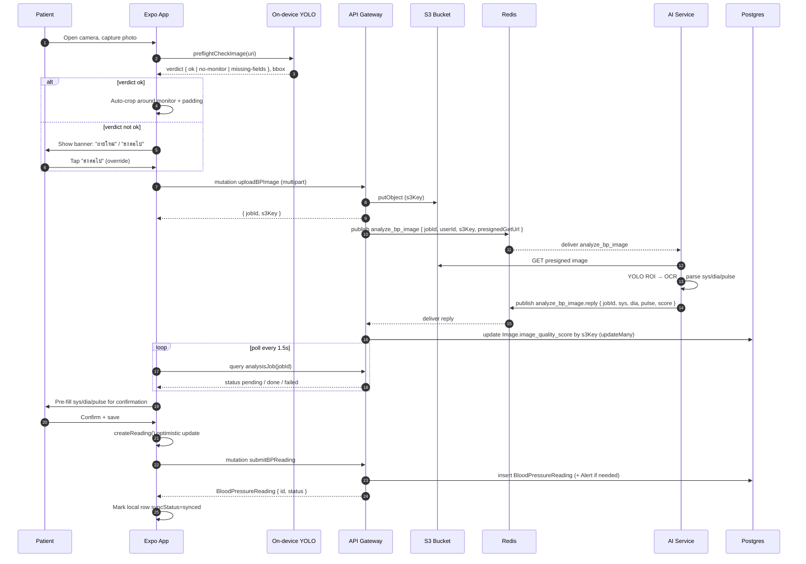

## End-to-end sequence

Numbers in the diagram match the ordering below. Steps 11-14 (poll loop)
collapse to a single done in the common case.

## Why on-device pre-flight

- **Save backend roundtrips on obviously bad shots** — If the model says
  no-monitor we never burn the AI service compute or the user's data plan.
  Verdict comes from a 10.7 MB ONNX model already on the phone.
- **Same model file on both sides** — client/assets/models/yolo11n.onnx and
  server/app/ai-service/models/yolo11n.onnx are byte-identical (SHA256 enforced
  by prestart hook). The phone's verdict is the backend's verdict.
- **Warn, do not block** — A "ส่งต่อไป" button always lets the user override.
  False negatives are common (lighting, glare); blocking would strand the
  patient.

## Latency budget

- **Capture → upload starts: under 1s** — YOLO inference + crop + image-prepare
  on a mid-range Android phone. Above this the camera feels broken.
- **Upload → AI ack: 2-6s typical** — S3 PUT + Redis publish + AI service
  handling. Poll cadence is 1.5s so the user sees a result within one tick of
  completion.
- **Save is independent of AI** — If AI fails or the network drops, the user
  can still type values manually and the reading saves via the offline queue.

## Failure modes worth naming

- **Stale job after app restart** — If the user backgrounds the app, the
  polling resumes by querying analysisJob(jobId) — we don't lose the result,
  but we do drop the visible spinner.
- **Image quality score back-write race** — AiProcessor writes
  image_quality_score via updateMany by s3Key — a deleted Image row
  (cron-swept) does not fail the analysis.
