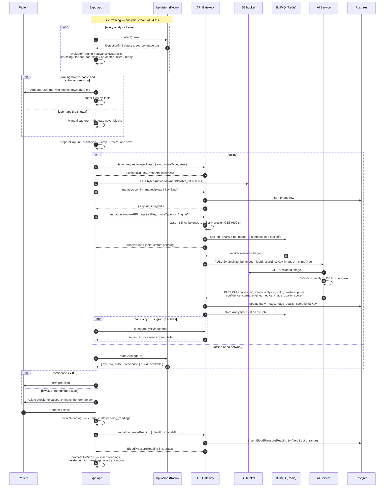

## End-to-end sequence

Three round trips pretend to be one call: presign + PUT + confirm puts the
photo on the server, `analyzeBPImage` only *enqueues* the work, and the numbers
arrive through a poll. The offline branch skips all of it and reads the display
on the phone. Both branches end at the same save.

## Why on-device detection

- **Coach the shot instead of judging it afterwards** — the detector runs on
  the live analysis stream, so the user is told "too far" while they can still
  move, rather than after a round trip. The same pass is what fires
  auto-capture. See [flow-yolo-preflight.md](./flow-yolo-preflight.md).
- **Same model file on both sides** — `client/assets/models/yolo11n.onnx` and
  the ai-service copy are byte-identical, SHA256-gated by
  `scripts/verify-models.mjs` on every `pnpm start`. The phone's classes mean
  what the server's classes mean.
- **Nudge, never gate** — nothing in the framing logic can stop a manual
  shutter tap. A detector false negative must not be able to prevent someone
  recording their blood pressure.
- **It degrades to nothing gracefully** — `bp-vision` is Android-only and
  resolved with `requireOptionalNativeModule`, so on iOS, web, and Expo Go
  every export returns "unavailable" and the screen falls through to the online
  or manual path.

## Latency budget

- **Frame → framing verdict: one analysis frame** — roughly 4 fps, and the
  verdict is smoothed by hysteresis before the UI shows it, so a flickering
  detection does not produce flickering coaching copy.
- **Capture → upload starts: under 1 s** — `prepareCaptureForAnalysis` (crop
  and resize in a single manipulator chain) on a mid-range Android phone.
- **Upload → result: seconds, and allowed to be** — presign + PUT + confirm,
  then a BullMQ job, then the Redis round trip. The client polls every 1.5 s and
  gives up at 60 s; the gateway's own call to ai-service times out at 55 s.
- **Save is independent of every one of those** — if analysis fails, times out,
  or the network is gone, the user types the numbers and the reading saves
  through the outbox.

## Failure modes worth naming

- **The reply is pub/sub, so an ai-service restart mid-job loses the message** —
  the gateway's `send()` times out at 55 s and BullMQ retries (3 attempts,
  exponential backoff). This is also why a second ai-service replica would
  double-analyse every image.
- **`imageId` must be carried into `createReading`** — `analyzeImage` returns
  the `Image.id` the upload minted. Dropping it makes the outbox drain upload
  the same photo a second time.
- **Image-quality back-write is best-effort** — `AiProcessor` writes
  `image_quality_score` with `updateMany` keyed by `s3Key`, so a row already
  swept by the orphan cleanup records zero updates instead of failing the
  analysis.
- **A cancelled analysis is not a failure** — the screen aborts the poll on
  retake or unmount, and an `AbortError` resolves to "no prefill", never to an
  error banner.
