## States and transitions

The `AnalysisPhase` union is literal: `idle | reading | uploading | queued |
processing | done | failed`, and `PHASE_LABEL` is the Thai copy each one shows.
`reading` belongs to the on-device path and `uploading / queued / processing` to
the online one, which is why "AI" appears in the label of the second group and
deliberately not in the first.

```mermaid
stateDiagram-v2
    [*] --> framing

    state framing {
        [*] --> searching
        searching --> too_far: monitor found, area < 8%
        searching --> too_close: area > 85%
        too_far --> off_center: distance ok
        too_close --> off_center: distance ok
        off_center --> ready: centre within 22%, 2 of 3 fields visible
        ready --> searching: shot drifts (hysteresis, then re-classify)
        ready --> armed: held ready for 300 ms, auto-capture on
        armed --> counting: ring appears
        counting --> ready: tap to cancel, or framing degrades
        counting --> [*]: countdown completes (1500 ms; 2500 ms with a screen reader)
    }

    framing --> captured: shutter fires — auto or manual tap
    captured --> prepared: prepareCaptureForAnalysis (crop + resize, one save)

    state analysis {
        [*] --> online_or_not
        state online_or_not <<choice>>
        online_or_not --> uploading: network available
        online_or_not --> reading: offline / online path failed

        uploading --> queued: analyzeBPImage returned a jobId
        queued --> processing: worker picked the job up
        processing --> done: reply parsed
        processing --> failed: job failed or 60 s poll timeout
        uploading --> failed: presign, PUT, or confirm failed

        reading --> done: bp-vision returned sys/dia/pulse
        reading --> [*]: module unavailable — phase clears to idle
    }

    prepared --> analysis
    analysis --> prefilled: numbers read — filled whatever the confidence
    analysis --> unreadable_dialog: engine ran on this photo and read nothing
    analysis --> empty_form: failed (user taps ยืนยันภาพ), or no engine on this platform
    analysis --> [*]: superseded by a retake — no fill, no sheet, no dialog

    prefilled --> prefilled: confidence < 0.5 — review banner, single ack
    unreadable_dialog --> framing: "ถ่ายใหม่" — back to the live preview
    unreadable_dialog --> empty_form: "กรอกเอง" — manual entry, fields blank

    prefilled --> editing
    empty_form --> editing
    editing --> saving: user taps save
    saving --> editing: validation error (e.g. sys out of range)
    saving --> [*]: createReading() — queued, then drained
```

## Why this shape

- **The framing gate is a nudge, never a gate** — nothing in the left-hand
  machine can prevent a manual shutter tap. Auto-capture is the only thing it
  drives, and a tap on the preview cancels the countdown and refuses to re-arm
  until the shot stops being `ready` at least once.
- **Hysteresis before UI** — `evaluateFraming` classifies a single frame with no
  memory, which flickers near every threshold. `advanceHysteresis` is what makes
  the coaching line stable enough to show a person.
- **Two read paths, one save** — online analysis and on-device OCR return the
  same `ReadOutcome` and raise the same low-confidence flag, so the offline path
  cannot drift into being a second, less tested way of recording a reading.
- **0.5 is the confidence line, both engines** — it decides whether the user is
  asked to double-check, not whether the form is filled. Both sides of the line
  auto-fill; below it a review banner with a single acknowledgement asks the
  user to compare against the monitor's own display. A wrong number nobody
  noticed becomes a wrong number in a medical history — but the older
  two-button "use these / I'll type them" prompt bought nothing against that
  risk which the banner does not, and charged a tap for it.
- **"Read nothing" is a dialog, not a banner** — an engine that ran on the photo
  and produced nothing interrupts with `Alert.alert`, because the fix is
  physical (square the monitor to the camera, don't tilt it, don't hold it
  upside down) and belongs in front of the user rather than inside a form they
  may never scroll to. Its primary action returns to the live preview; its
  secondary opens the form empty. That second action is what keeps "nothing can
  block a save" true for a monitor this engine can never read.
- **A cancelled analysis is not a failure** — `AbortError` returns null and
  leaves no error banner. The user moving on is not an incident.
- **A superseded read is silent on both sides** — retaking, or capturing again,
  invalidates any analysis still running: `analyze` aborts its request,
  `readOnDevice` drops its result, and the screen ignores the outcome
  regardless. Retaking without capturing again counts, which is why both
  `startCaptureFlow` and `retake` advance the screen's capture generation. A
  late result from a discarded photo must not fill fields, raise the dialog, or
  open the sheet over a live camera.
- **Saving is optimistic and offline-safe** — `createReading()` enqueues into
  `pending_readings` and the drain promotes it to the mirror once the server
  confirms. See [state-reading-lifecycle.md](./state-reading-lifecycle.md).
