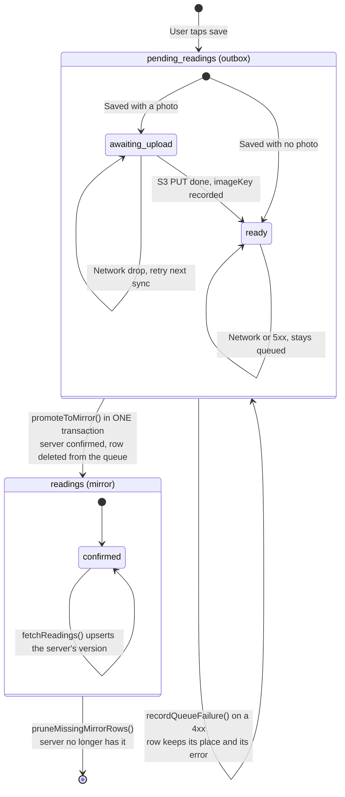

## Lifecycle

A reading's state is **which table it is in**, not a column value. There is no
`syncStatus`: a queued row lives in `pending_readings`, a confirmed row lives
in `readings`, and `promoteToMirror` moves it across in one transaction
(`client/src/modules/readings/repository/mirror.ts`).

## Why two tables and not one

The old client kept a single `pending_readings` table doing both jobs, told
apart by a `syncStatus` column. That design is gone, and the reason it went is
worth keeping: **every read had to remember to filter on the column, and
forgetting to was a bug the patient saw** — as duplicated or missing history.
`client/src/database/schema.ts` records this at the top of the file.

- **The question becomes structural.** "Which rows still need sending?" is
  answered by which table you are looking at, not by a predicate a future
  caller can omit.
- **Each table is indexed for its own job.** The queue is short-lived and
  write-heavy; the mirror is long-lived and read-heavy.
- **Reinstall safety is unchanged.** The mirror keeps confirmed rows on device,
  so an offline launch after a reinstall still shows history. Splitting the
  tables did not cost that — the mirror is what provides it.

**The cost, and the invariant:** confirming a sync now writes to two tables.
`promoteToMirror` does the insert and the delete in a single transaction. A
non-transactional version can insert without deleting (the reading duplicates)
or delete without inserting (the reading vanishes). That transaction is the one
thing this design depends on.

## Adjacent rules

- **The sync mutex** — concurrent callers get the in-flight promise rather than
  starting a second pass. Do not replace it with a boolean flag; that is
  race-prone.
- **Sync is triggered in exactly one place** —
  `modules/readings/hooks/use-readings-sync.tsx` owns the app's only `AppState`
  and `NetInfo` listeners and the only automatic pull. Screens call
  `useReadingsSync()`. Wiring `useFetchReadings` or `useSyncReadings` into a
  screen reintroduces duplicated listeners and a pull that only runs on
  pull-to-refresh.
- **Local IDs are typed** — local rows carry a `local-` prefixed id, and
  `isLocalReadingId` is the only canonical check. String-matching `local-`
  elsewhere is a smell.
- **`createClientId(prefix, userId)`** — timestamp plus 120 bits of randomness,
  and the primary key of the queue, so a retried submit cannot enqueue the same
  reading twice. Never hand-roll it from `Math.random()`: a collision is a
  silent overwrite.
