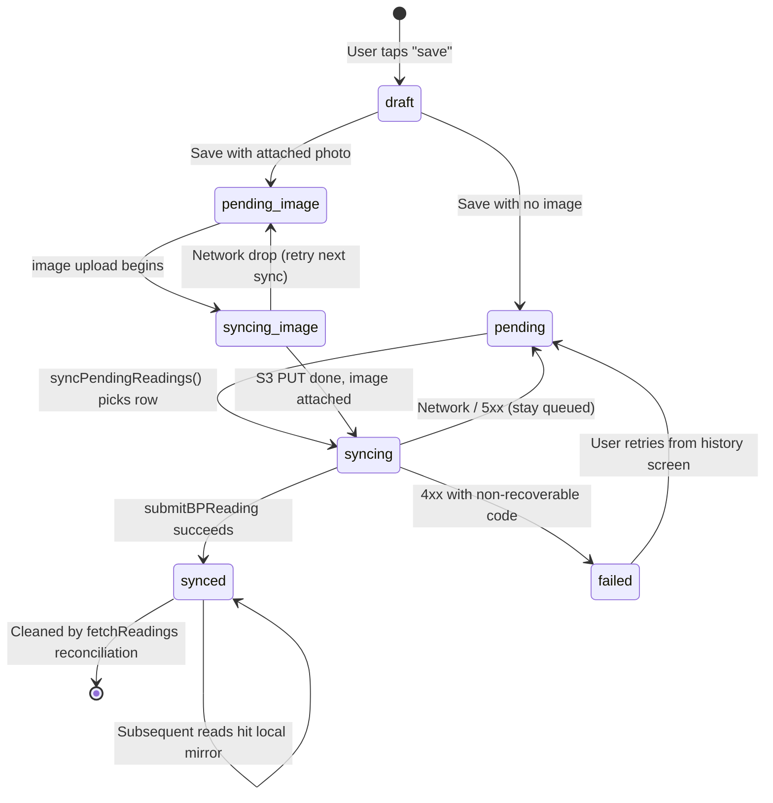

## Lifecycle

States mirror the syncStatus column in pending_readings
(client/data/local-db.ts).

## Why one table for queue and mirror

- **Reinstall safety** — If we deleted synced rows the moment the server
  confirmed, an offline launch after reinstall would show an empty history even
  though it just succeeded a minute ago. Keeping the row preserves the user's
  mental model.
- **No deletion race** — A sync now marks rows synced in place (with remoteId
  set) rather than DELETE-then-INSERT. Partial sync, duplicate sync, and lost
  mutex releases can't leave data in a torn state.
- **Reconciliation is the source of truth** — fetchReadings is the single point
  that reconciles local mirror with the server. Pending/syncing rows stay;
  synced rows refresh from the server response.

## Adjacent rules

- **syncReadingsPromise mutex** — Concurrent callers of syncPendingReadings
  return the in-flight promise instead of starting a second pass. Don't replace
  this with a boolean flag — race-prone.
- **Local IDs are typed** — Local rows have id prefixed with `local-`.
  isLocalReadingId is the only canonical check; string-matching `local-`
  elsewhere is a code smell.
- **createClientId(prefix, userId)** — Timestamp + 120 bits of randomness.
  Never use Math.random().slice(...) ad-hoc — collisions create silent
  overwrites when two devices sync the same user.
