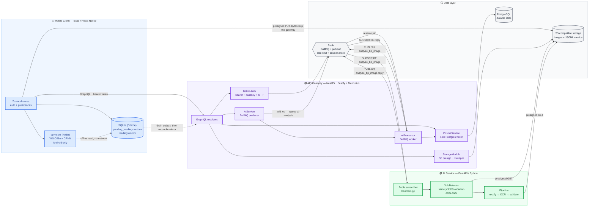

## The full picture

Edges are direct calls, queue hops, or pub/sub hops. Postgres is the only
durable store; Redis is a transport, a job store, and a rate-limit store, never
a system of record; SQLite on mobile is an outbox + mirror, not authority.

Note the **two hops** on the AI path. The resolver does not talk to ai-service
— it enqueues a BullMQ job, and a worker in the same process makes the Redis
request/reply call. That is the single most-missed thing about this diagram:
the retry budget, the job TTLs, and the poll the client runs all live on the
BullMQ half, not on the pub/sub half.

`web/` is deliberately absent. It is a fifth consumer of the datastores rather
than a gateway client, and it is not deployed at all — see
[deployment-topology.md](./deployment-topology.md) and
[package-structure.md](./package-structure.md).

## Key insights

What a reviewer should take away first.

- **One gateway, one client** — The mobile app hits the GraphQL endpoint with a
  Better Auth session token as a bearer. Any breaking schema change ships
  straight to the patient-facing client.
- **The AI path is a queue in front of a channel** — `analyzeBPImage` returns a
  `jobId` the moment the BullMQ job is accepted (`AiService.enqueue`, 3 attempts
  with exponential backoff). `AiProcessor` then makes one Redis request/reply
  call on `analyze_bp_image` / `analyze_bp_image.reply` with a 55 s timeout, and
  BullMQ stores the return value for the client's `analysisJob(jobId)` poll.
  Payload shapes are owned by `api-gateway/src/ai/ai.process.ts` and mirrored by
  `ai-service/src/ai_service/handlers.py`; both sides must change together.
- **ai-service must stay a singleton** — the reply path is pub/sub, which is
  fan-out with no ack. Two replicas duplicate every analysis. See the
  SINGLETON CONSTRAINT note at the top of `handlers.py` and
  [docs/research/ai-service-reply-transport.md](../research/ai-service-reply-transport.md).
- **S3 is direct from the mobile client** — BP images and avatars PUT straight
  to S3 via a presigned URL the gateway hands out
  (`client/src/services/upload-image.ts`). Bytes never tunnel through the
  gateway, so it doesn't become an upload bottleneck.
- **Redis is load-bearing for more than AI** — BullMQ jobs, the `analyze_bp_image`
  channel pair, the fixed-window rate limiter, and Better Auth's secondary
  session storage all live there. The gateway lazy-connects and degrades where
  it can, but this is no longer a "transport only" dependency.

## Design trade-offs

Choices that look ordinary but lock in behavior.

- **No shared types package** — GraphQL schema + Redis payload + S3 key layout
  are the only stable cross-process surfaces. Cost: hand-mirrored DTOs on both
  sides of the AI channel. Benefit: each service ships independently without a
  build-time coupling.
- **Asymmetric latency budgets** — UI calls must feel synchronous; AI analysis
  is async, poll-based. Anything that blocks a screen on the AI path is treated
  as a regression.
- **Postgres as the only source of truth** — SQLite (mobile) and Redis
  (transport, jobs, rate limits) are caches and queues, not authority. The
  mobile app writes to the `pending_readings` outbox first, drains it when the
  network allows, and reconciles the `readings` mirror on the next
  `fetchReadings()`; we accept some staleness for offline resilience. See
  [flow-offline-sync.md](./flow-offline-sync.md).
