## Actors and surfaces

Solid links: actor uses use case. Dotted links: one use case triggers another.
Caregiver edges are drawn for the `full` permission; a `view` link keeps only
the read-only ones.

```mermaid
graph TB
    P((Patient))
    C((Caregiver))
    D((Developer / Ops))
    AI((AI Service))

    subgraph Mobile["Mobile app (Expo) — the product"]
        UC1["Register / sign in<br/>phone, Google, or passkey"]
        UC2["Capture BP with the camera"]
        UC3["Enter BP manually"]
        UC4["View history, trends, alerts"]
        UC5["Export readings (CSV / PDF)"]
        UC6["Manage profile & avatar"]
        UC7["Read community posts"]
        UC8["Write / comment / like"]
        UC9["Invite or accept a caregiver link"]
        UC10["Manage devices & sessions"]
        UC17["Harden the account<br/>password, passkeys, app lock"]
        UC18["Set measurement reminders"]
        UC19["Read health tips"]
        UC20["Record a reading for a patient"]
        UC21["Edit a patient's health info"]
        UC22["Review who changed what<br/>(profile change log)"]
    end

    subgraph Web["Web app (Next.js) — team-only, local"]
        UC11["Read the docs site"]
        UC12["Inspect service status<br/>gateway · DB · Redis · S3 · AI"]
        UC13["Browse clients & readings"]
        UC14["Review these diagrams"]
        UC23["Read the task board"]
    end

    subgraph Async["Async surfaces"]
        UC15["Analyze BP image<br/>YOLO → rectify → OCR → validate"]
        UC16["Score image quality"]
        UC24["Send push notifications"]
    end

    P --- UC1
    P --- UC2
    P --- UC3
    P --- UC4
    P --- UC5
    P --- UC6
    P --- UC7
    P --- UC8
    P --- UC9
    P --- UC10
    P --- UC17
    P --- UC18
    P --- UC19
    P --- UC22

    C --- UC1
    C --- UC4
    C --- UC7
    C --- UC8
    C --- UC9
    C --- UC20
    C --- UC21

    D --- UC11
    D --- UC12
    D --- UC13
    D --- UC14
    D --- UC23

    AI --- UC15
    AI --- UC16

    UC2 -.triggers.-> UC15
    UC15 -.produces.-> UC16
    UC20 -.attributed via recordedById.-> UC4
    UC21 -.always writes.-> UC22
    UC4 -.out-of-range reading.-> UC24

    classDef actor fill:#fef3c7,stroke:#d97706,color:#92400e
    classDef uc fill:#dbeafe,stroke:#3b82f6,color:#1e3a8a
    classDef sys fill:#ede9fe,stroke:#7c3aed,color:#5b21b6
    class P,C,D actor
    class AI sys
    class UC1,UC2,UC3,UC4,UC5,UC6,UC7,UC8,UC9,UC10,UC11,UC12,UC13,UC14,UC15,UC16,UC17,UC18,UC19,UC20,UC21,UC22,UC23,UC24 uc
```

## Persona notes

- **Patient** — the primary actor on mobile. Owns readings, posts, and
  comments; logs BP by camera or by hand; reviews history and alerts; grants
  and revokes caregiver access.
- **Caregiver** — reaches a patient through a `CaregiverPatient` link that
  carries a `RelationshipType` (parent / patient / caregiver / child / spouse),
  a `CaregiverLinkStatus` (pending / accepted / rejected), and a
  `CaregiverPermission`. `view` is read-only; `full` additionally allows
  recording a reading on the patient's behalf and editing their health fields —
  never their login identity, since `email` and `phone` are both sign-in
  identifiers.
- **Developer / Ops** — a local-only persona. The web app is not deployed and
  has no authentication of its own, so this actor exists at a laptop, not in
  production. No patient-facing surface, and no write path to patient data.
- **AI Service** — a non-human actor reached only through the gateway's BullMQ
  worker and the `analyze_bp_image` channel pair. A black box from the
  gateway's perspective: the contract is the payload, not an API.
